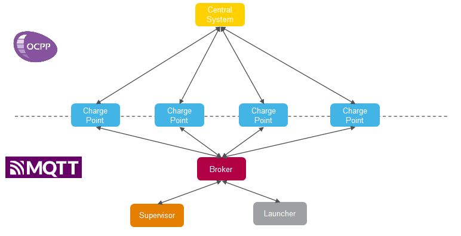
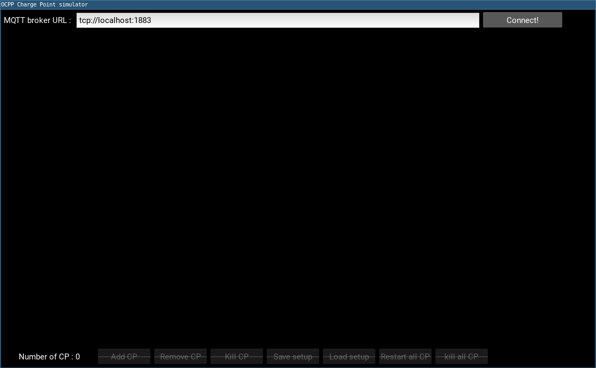
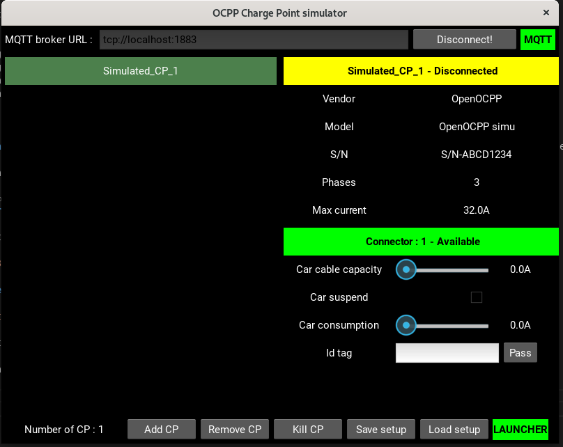
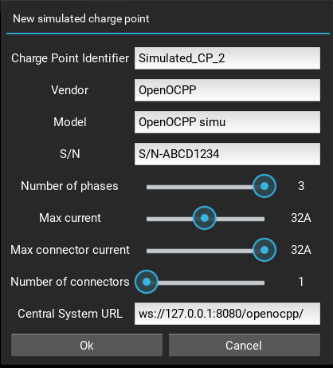

# Open OCPP simulator

Charge Point simulator environment based on [Open OCPP](https://github.com/c-jimenez/open-ocpp) library and [MQTT](https://mqtt.org/) protocol.



The simulators contains 3 applications :

* chargepoint : Simulated Charge Point based on Open OCPP
* launcher : Daemon which will add/remove/start/stop the simulated Charge Points instances
* supervisor : User friendly HMI to monitor and configure the Charge Point simulators

These 3 applications are communicating using the MQTT protocol and the simulated Charge Point instances communicate also using OCPP protocol with a Central System.

## Table of contents
- [Install and build](#install-and-build)
- [Usage](#usage)
- [Under the hood](#under-the-hood)


## Install and build

### Pre-requisites
The project can be be built using ether docker or natively.

### With Docker
Docker must be installed.

Run the makefile target:
```
make docker-build-images
```

### Without Docker

* Open OCPP library (see [Build and installation procedure](https://github.com/c-jimenez/open-ocpp#build))
* [Paho MQTT library](https://www.eclipse.org/paho/) 1.3.8 or greater
* Python 3.8 or greater with the following packages : kivy, paho-mqtt
* [Mosquitto MQTT broker](https://mosquitto.org/) 2.0.11 or greater

For information, most of the development has been made on the following environment:

* Debian 11 (Bullseye)
* gcc 10.2 and clang 11.0
* Python 3.9
* Mosquitto 2.0.11

On Debian the pre-requisites (except for Open OCPP) can be installed using the following commands:

```
sudo apt install python3 python3-pip mosquitto libpaho-mqtt-dev
python3 -m pip install -r requirements.txt
```

### Build options

The build is based on CMake, the following definitions must be passed to the CMake command to customize the build :

* **TARGET** : Allow to load the appropriate *CMakeLists_TARGET.txt* file
* **BIN_DIR** : Output directory for the generated binaries
* **CMAKE_BUILD_TYPE** : Can be set to either Debug or Release (Release build produces optimized stripped binaries)

Additionnaly, the **CMakeLists_Options.txt** contains several options that can be switched on/off.

An helper makefile is available at project's level to simplify the use of CMake. Just use the one of the following commands to build using gcc or gcc without cross compilation :

```make gcc-native``` or ```make clang-native``` or ```make gcc-native BUILD_TYPE=Debug``` or ```make clang-native BUILD_TYPE=Debug```

The option ```DISABLE_DOCKER=1``` allows to build natively without docker.

This makefile also contains the corresponding cleaning targets :

```make clean-gcc-native``` or ```make clean-clang-native```


The build generates the following 2 executables :

* chargepoint
* launcher

## Usage

The whole simulation environment is based on MQTT so the mosquitto broker must always be started to make it work.
On Debian, the mosquitto broker can be started or stopped using th following commands:

```
systemctl start mosquitto
systemctl stop mosquitto
```

It can also be started automatically at system's startup using the following commands :

```
systemctl enable mosquitto
systemctl disable mosquitto
```

### Working directory

The working directory of the simulation environment must contain the following files :

* chargepoint
* launcher
* config.ini

The first 2 files are the binaries generated during the build. The last one is a configuration file which will be used as a template for the configuration of all the instances of the simulated Charge Points. You will find an example in the binaries directory alongside the 2 other files.

Then the **launcher** daemon will create a **charepoints** directory with a dedicated subdirectory for each simulated Charge Point instance and containing their persistent data.

### Starting the simulation

To start the simulation environment, use the following command :

```./launcher```

You must then see the following logs indicating that it has successfully connected to the MQTT broker and that it is wainting for commands :

```
OCPP charge point simulator launcher
Connecting to the broker (tcp://localhost:1883)...
Subscribing to simulated charge point's topics...
Subscribing to launcher's command topic...
Ready!
```

The **launcher** daemon must run to allow the **supervisor** to monitor and configure the simulated Charge Point instances.

To stop the **launcher**, just press Ctrl+C.

### Monitoring the simulation

To start the **supervisor**, use the following command from within the **src/supervisor** directory :

```python3 main.py```

The **supervisor** window will appear :



Click on the "Connect!" button to connect to the MQTT broker and to the **launcher**.

You will now have access to the simulated Charge Point instances :



On the left of the window is the list of the simulated Charge Point instances. After selecting an instance, the right part of the window will contain :

* The instance's information : name, registration status with the Central System, configuration
* For each connector :
    - Id and OCPP status
    - Simulated inputs : car cable, car suspension, car consumption and id tag

On the bottom of the window are the command buttons :

* Add CP : instanciate a new simulated Charge Point
* Remove CP : remove a simulated Charge Point from the simulation environment
* Kill CP/Restart CP : kill/restart the simulated Charge Point instance
* Save setup : save the current simulation environment into a JSON file
* Load setup : load a previously save simulation environment from a JSON file

When adding a new simulated Charge Point, the following window will appear :



At this step you will configure the simulated Charge Point's behavior for current consumption and the URL of the Central System it must connect to.

**Warning** : These settings cannot be modified afterwards. You will have to remove the current Charge Point and add a new one to "modify" them.

### Ending the simulation

Once started, the simulated Charge Points will keep running even if the **launcher** and/or the **supervisor** are not running anymore.
To take back control of the simulated Charge Points, just restart the **launcher** and the **supervisor** : they will appear into the list on the left side of the window.

You can then kill or remove the simulated Charge Points if needed.

## Under the hood

The whole simulation environment can be monitored and controled through MQTT messages.

Here is the MQTT topic tree of the simulation environment :

```
cp_simu
 |--launcher
 |   |-cmd
 |   |-status
 |--cps
 |   |-simu_cp_XXX
 |   |  |-status
 |   |  |-connectors
 |   |  |  |-1
 |   |  |  | |-car
 |   |  |  | |-id_tag
 |   |  |  | |-status
 |   |  |  |-N
 |   |  |  | |-car
 |   |  |  | |-id_tag
 |   |  |  | |-status
 |   |-simu_cp_YYY
 |   |  |-status
 |   |  |-connectors
 |   |  |  |-1
 |   |  |  | |-car
 |   |  |  | |-id_tag
 |   |  |  | |-status
 |   |  |  |-N
 |   |  |  | |-car
 |   |  |  | |-id_tag
 |   |  |  | |-status
```

The simulation environment takes advantage of 2 MQTT features :

* Retained messages : all the status messages are retained to allow to obtain the simulation environment status on connection
* Will messages : the **launcher** and the simulated Charge Points both register a will message on their status topic so that it can be automatically updated when they stop after a crash or a user interruption

To remove a simulated Charge Point from the simulation environment, use the following protocol :

* Kill the simulated Charge Point instance through the **launcher** API
* Remove the retained status of the simulated Charge Point and its connectors in the MQTT broker by sending a retained message with an empty payload on their status topics

### Launcher API

The **launcher** publishes its status as a retained message on the following topic : **cp_simu/launcher/status**.

The status can be either ```Alive``` or ```Dead```.

The **launcher** listens to the following topic : **cp_simu/launcher/cmd**.

#### Start command

The start command allow to instanciate and start one or more new simulated Charge Points.

Payload :

```
{
    "type": "start",
    "charge_points": [
        { "id": "simu_cp_XXX", "vendor": "Open OCPP", "model": "Simulated CP", "serial": "S/NABCD1234", "central_system": "ws://localhost:8080", "nb_connectors": 1, "nb_phases": 3, "max_current": 32, "max_current_per_connector": 16 },
        { "id": "simu_cp_YYY", "vendor": "Open OCPP", "model": "Simulated CP", "serial": "S/NABCD5678", "central_system": "ws://localhost:8080", "nb_connectors": 2, "nb_phases": 1, "max_current": 32, "max_current_per_connector": 32 }
    ]
}
```

#### Kill command

The kill command allow to kill one or more running simulated Charge Point instances.

Payload :

```
{
    "type": "kill",
    "charge_points": [
        { "id": "simu_cp_XXX" },
        { "id": "simu_cp_YYY" }
    ]
}
```

#### Restart command

The restart command allow to restart one or more previously killed simulated Charge Point instances.

Payload :

```
{
    "type": "restart",
    "charge_points": [
        { "id": "simu_cp_XXX", "vendor": "Open OCPP", "model": "Simulated CP", "serial": "S/NABCD1234", "central_system": "ws://localhost:8080", "nb_connectors": 1, "nb_phases": 3, "max_current": 32, "max_current_per_connector": 16 },
        { "id": "simu_cp_YYY", "vendor": "Open OCPP", "model": "Simulated CP", "serial": "S/NABCD5678", "central_system": "ws://localhost:8080", "nb_connectors": 2, "nb_phases": 1, "max_current": 32, "max_current_per_connector": 32 }
    ]
}
```

### Charge Point API

The simulated Charge Points publish their status as a retained message on the following topic : **cp_simu/cps/simu_cp_XXX/status**.

The status message has the following payload :

```
{
    "pid":69672,
    "status":"Disconnected",
    "vendor":"Open OCPP",
    "model":"Simulated CP",
    "serial":"S/NABCD1234",
    "nb_phases":3,
    "max_setpoint":32.0,
    "central_system":"wss://127.0.0.1:9980/"
}
```

Each connector of the simulated Charge Point publishes its status as a retained message on the following topic : **cp_simu/cps/simu_cp_XXX/connectors/N/status** where **N** stands for the connector number.

The status message has the following payload :

```
{
    "status":"Available",
    "id_tag":"",
    "max_setpoint":32.0,
    "ocpp_setpoint":32.0,
    "setpoint":0.0,
    "consumption_l1":0.0,
    "consumption_l2":0.0,
    "consumption_l3":0.0,
    "car_consumption_l1":0.0,
    "car_consumption_l2":0.0,
    "car_consumption_l3":0.0,
    "car_cable_capacity":0.0,
    "car_ready":true
}
```

Each connector of the simulated Charge Point are listening to the following topic to simulate interaction with a car : **cp_simu/cps/simu_cp_XXX/connectors/N/car** where **N** stands for the connector number.

The expected command payload is :

 ```
 {
    "cable": 32.0,
    "ready": true,
    "consumption_l1": 10.0,
    "consumption_l2": 10.0,
    "consumption_l3": 10.0
 }
 ```

Each connector of the simulated Charge Point are listening to the following topic to simulate interaction with a user resenting an RFID card : **cp_simu/cps/simu_cp_XXX/connectors/N/id_tag** where **N** stands for the connector number.

The expected command payload is :

 ```
 {
    "id": "ID_TAG"
 }
 ```

Each connector of the simulated Charge Point are listening to the following topic to force the Charge Point in faulted status : **cp_simu/cps/simu_cp_XXX/connectors/N/faulted** where **N** stands for the connector number.

The expected command payload is :

 ```
 {
    "faulted": false
 }
 ```


Each simulated Charge Point are listening to the following topic to execute a certain command: **cp_simu/cps/simu_cp_XXX/cmd**.

The expected command payload is :
 ```
 {
    "type": "<cmd>"
 }
 ```
So far there are 2 commands:
* close: ask to end the application
* ocpp_config: ask to send on MQTT topic **cp_simu/cps/simu_cp_XXX/ocpp_config** all the OCPP config of the Charge Point